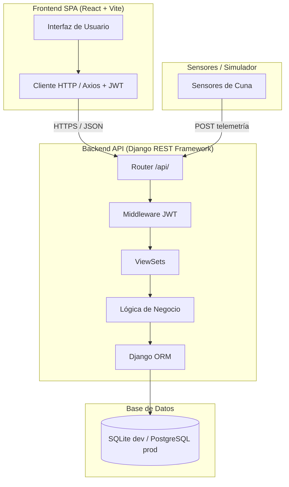

## 1. Estilo Arquitectónico
Estilo adoptado: **Arquitectura Cliente-Servidor con API REST y Separación por Capas** (SPA Frontend + Backend RESTful)

### Justificación basada en REF priorizados:

| REF ID | Descripción | Prioridad | Cómo lo aborda el estilo |
|---|---|---|---|
| REF-01 | Tiempo de respuesta < 2s | Alta | El frontend SPA se renderiza en el cliente y solo pide datos JSON al backend, minimizando la carga por petición. |
| REF-02 | Disponibilidad >= 99% | Alta | Frontend estático y backend API son independientes; se puede reiniciar uno sin afectar al otro. |
| REF-03 | Autenticación JWT/RBAC | Alta | REST stateless se combina con JWT, validando cada petición en middleware sin sesiones en servidor. |
| REF-05 | Alertas automáticas | Alta | La lógica de evaluación de signos vitales se centraliza en el backend como fuente única de verdad. |
| REF-09 | Python / Django / DRF | Alta | REST se alinea nativamente con DRF: routers, serializers y viewsets generan los endpoints. |
| REF-10 | BD relacional ACID | Alta | El ORM de Django desacopla la lógica de negocio de la base de datos, asegurando transacciones atómicas. |

### Explicación textual:
El estilo elegido para **Poki Koa** es una arquitectura cliente-servidor desacoplada. El frontend (React SPA) se encarga de la presentación y el backend (Django REST Framework) expone una API REST con la lógica de negocio y persistencia.

Esta separación permite que la interfaz responda rápido sin recargas de página completas (REF-01), que el sistema sea más resiliente al aislar fallos entre cliente y servidor (REF-02), y que la autenticación JWT funcione de forma stateless en cada petición (REF-03). Centralizar la lógica de alertas en el backend garantiza que ningún evento crítico se pierda aunque el navegador esté cerrado (REF-05).

---

## 2. Diagrama de Arquitectura

El siguiente diagrama muestra la arquitectura del sistema, con la separación de capas y el flujo de información desde los sensores hasta la interfaz:

---

## 3. Descomposición Modular

### Fundamentación:
La descomposición sigue el principio de separación de responsabilidades. Cada módulo encapsula una funcionalidad del dominio clínico neonatal y se comunica con los demás mediante relaciones del ORM y la API REST.

---

### Módulo 1: Autenticación y Roles (AuthModule)
- **Responsabilidad:** Verificar credenciales, emitir tokens JWT y controlar acceso por rol (Matrona, Médico, Administrador).
- **Ofrece a otros módulos:** Middleware de autenticación, permisos por rol, endpoints de login y refresh de token.
- **Depende de:** ORM / Base de datos.

---

### Módulo 2: Personal Clínico y Pacientes (ClinicalModule)
- **Responsabilidad:** Gestionar perfiles de médicos (nombre, turno) y el ciclo de vida del paciente neonatal (ingreso, datos demográficos, diagnóstico, médico a cargo).
- **Ofrece a otros módulos:** Entidades `Medico` y `Bebe` con sus serializers, consulta de pacientes por médico asignado.
- **Endpoints:** `GET/POST /api/medicos/`, `GET/POST /api/bebes/`, detalle con `/{id}/`.
- **Depende de:** ORM / Base de datos.

---

### Módulo 3: Cunas y Signos Vitales (CribsModule)
- **Responsabilidad:** Gestionar las cunas físicas (identificador, ocupación) y mantener los signos vitales en tiempo real del paciente asignado (frecuencia cardíaca, SpO2, temperatura, estado de sueño, cánula, vía IV).
- **Ofrece a otros módulos:** Estado de ocupación para el dashboard, datos de signos vitales para el motor de alertas.
- **Endpoints:** `GET/POST /api/cunas/`, `PATCH /api/cunas/{id}/`.
- **Depende de:** Módulo de Pacientes, ORM.

---

### Módulo 4: Motor de Alertas (AlertsModule)
- **Responsabilidad:** Evaluar signos vitales contra umbrales fisiológicos y generar alertas clasificadas por severidad (Info, Advertencia, Crítica).
- **Ofrece a otros módulos:** Feed de alertas activas, historial de alertas por paciente.
- **Endpoints:** `GET/POST /api/alertas/`, `PATCH /api/alertas/{id}/`.
- **Depende de:** Módulo de Cunas, Módulo de Pacientes, ORM.

---

### Módulo 5: Control Farmacológico (MedicationModule)
- **Responsabilidad:** Registrar prescripciones de medicamentos (nombre, dosis, vía de administración, hora) y gestionar su estado (Pendiente / Administrado).
- **Ofrece a otros módulos:** Lista de medicamentos pendientes y administrados por paciente.
- **Endpoints:** `GET/POST /api/medicamentos/`, `PATCH /api/medicamentos/{id}/`.
- **Depende de:** Módulo de Pacientes, ORM.

---

## 4. Decisiones de Diseño

### Decisión 1: Separación Frontend SPA y Backend API REST
- **Decisión:** Implementar el frontend como SPA en React y el backend como API REST en Django, comunicados por HTTP/JSON.
- **Motivación:** Cumple REF-01 (rendimiento sin recargas de página), REF-07 (mantenibilidad) y REF-08 (SPA moderna). Permite que el equipo trabaje en frontend y backend de forma independiente.
- **Alternativas consideradas:**
  - *Monolito Django con templates:* Descartada porque cada actualización de signos vitales requeriría recargas de página, degradando la experiencia de monitoreo continuo.
  - *Microservicios:* Descartada por complejidad excesiva para el tamaño del equipo y plazos del proyecto.
- **Impacto:** Define la estructura general del proyecto y la comunicación entre subsistemas.

---

### Decisión 2: Signos vitales almacenados directamente en el modelo Cuna
- **Decisión:** Guardar el último valor de signos vitales (FC, SpO2, temperatura) como campos del modelo `Cuna`, actualizados en cada lectura del sensor.
- **Motivación:** Simplifica las consultas del dashboard (REF-01) al no requerir joins adicionales para obtener el estado actual de cada cuna. Es el enfoque más directo para la etapa actual del proyecto.
- **Alternativas consideradas:**
  - *Modelo separado de lecturas con consulta de último valor:* Descartada en esta etapa porque agrega complejidad sin beneficio inmediato. Se puede agregar un historial en futuras iteraciones.
- **Impacto:** Afecta al módulo de Cunas y al motor de Alertas.

---

### Decisión 3: Autenticación Stateless con JWT
- **Decisión:** Usar tokens JWT para autenticar todas las peticiones a la API, con control de acceso basado en roles.
- **Motivación:** Cumple REF-03 (seguridad) y REF-04 (comunicación segura). Al ser stateless, evita problemas de CORS con sesiones entre el frontend (puerto 5173) y backend (puerto 8000).
- **Alternativas consideradas:**
  - *Sesiones Django con cookies:* Descartada por complejidad con CORS y CSRF en una arquitectura desacoplada con puertos distintos.
- **Impacto:** Afecta al módulo de Autenticación y a la configuración global de DRF.
