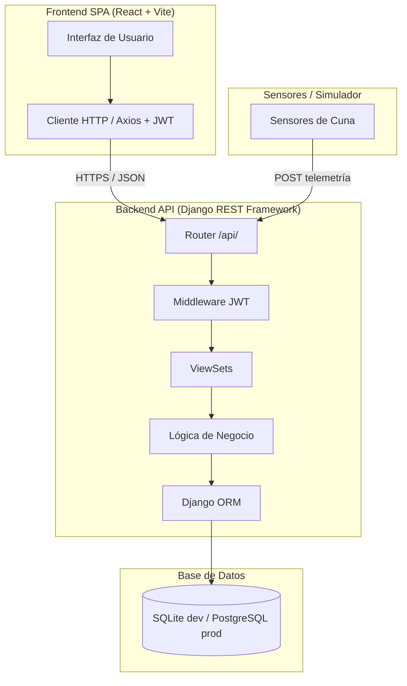

## 1. Estilo Arquitectónico
Estilo adoptado: **Arquitectura Cliente-Servidor con API REST y Separación por Capas** (SPA Frontend + Backend RESTful)

### Justificación basada en REF priorizados:

| REF ID | Descripción | Prioridad | Cómo lo aborda el estilo |
|---|---|---|---|
| REF-01 | Tiempo de respuesta < 2s | Alta | El frontend SPA se renderiza en el cliente y solo pide datos JSON al backend, minimizando la carga por petición. |
| REF-02 | Disponibilidad >= 99% | Alta | Frontend estático y backend API son independientes; se puede reiniciar uno sin afectar al otro. |
| REF-03 | Autenticación JWT/RBAC | Alta | REST stateless se combina con JWT, validando cada petición en middleware sin sesiones en servidor. |
| REF-05 | Alertas automáticas | Alta | La lógica de evaluación de signos vitales se centraliza en el backend como fuente única de verdad. |
| REF-09 | Python / Django / DRF | Alta | REST se alinea nativamente con DRF: routers, serializers y viewsets generan los endpoints. |
| REF-10 | BD relacional ACID | Alta | El ORM de Django desacopla la lógica de negocio de la base de datos, asegurando transacciones atómicas. |

### Explicación textual:
El estilo elegido para **Poki Koa** es una arquitectura cliente-servidor desacoplada. El frontend (React SPA) se encarga de la presentación y el backend (Django REST Framework) expone una API REST con la lógica de negocio y persistencia.

Esta separación permite que la interfaz responda rápido sin recargas de página completas (REF-01), que el sistema sea más resiliente al aislar fallos entre cliente y servidor (REF-02), y que la autenticación JWT funcione de forma stateless en cada petición (REF-03). Centralizar la lógica de alertas en el backend garantiza que ningún evento crítico se pierda aunque el navegador esté cerrado (REF-05).

---

## 2. Diagrama de Arquitectura

El siguiente diagrama muestra la arquitectura del sistema, con la separación de capas y el flujo de información desde los sensores hasta la interfaz:

```mermaid
graph TB
    subgraph Frontend ["Frontend SPA (React + Vite)"]
        UI["Interfaz de Usuario"]
        HTTP_Client["Cliente HTTP / Axios + JWT"]
        UI --> HTTP_Client
    end

    subgraph Backend ["Backend API (Django REST Framework)"]
        Router["Router /api/"]
        Auth["Middleware JWT"]
        Views["ViewSets"]
        Logic["Lógica de Negocio"]
        ORM["Django ORM"]

        HTTP_Client -- "HTTPS / JSON" --> Router
        Router --> Auth
        Auth --> Views
        Views --> Logic
        Logic --> ORM
    end

    subgraph DB ["Base de Datos"]
        Database[("SQLite dev / PostgreSQL prod")]
        ORM --> Database
    end

    subgraph IoT ["Sensores / Simulador"]
        Sensors["Sensores de Cuna"]
        Sensors -- "POST telemetría" --> Router
    end
```

---

## 3. Descomposición Modular

### Fundamentación:
La descomposición sigue el principio de separación de responsabilidades. Cada módulo encapsula una funcionalidad del dominio clínico neonatal y se comunica con los demás mediante relaciones del ORM y la API REST.

---

### Módulo 1: Autenticación y Roles (AuthModule)
- **Responsabilidad:** Verificar credenciales, emitir tokens JWT y controlar acceso por rol (Matrona, Médico, Administrador).
- **Ofrece a otros módulos:** Middleware de autenticación, permisos por rol, endpoints de login y refresh de token.
- **Depende de:** ORM / Base de datos.

---

### Módulo 2: Personal Clínico y Pacientes (ClinicalModule)
- **Responsabilidad:** Gestionar perfiles de médicos (nombre, turno) y el ciclo de vida del paciente neonatal (ingreso, datos demográficos, diagnóstico, médico a cargo).
- **Ofrece a otros módulos:** Entidades `Medico` y `Bebe` con sus serializers, consulta de pacientes por médico asignado.
- **Endpoints:** `GET/POST /api/medicos/`, `GET/POST /api/bebes/`, detalle con `/{id}/`.
- **Depende de:** ORM / Base de datos.

---

### Módulo 3: Cunas y Signos Vitales (CribsModule)
- **Responsabilidad:** Gestionar las cunas físicas (identificador, ocupación) y mantener los signos vitales en tiempo real del paciente asignado (frecuencia cardíaca, SpO2, temperatura, estado de sueño, cánula, vía IV).
- **Ofrece a otros módulos:** Estado de ocupación para el dashboard, datos de signos vitales para el motor de alertas.
- **Endpoints:** `GET/POST /api/cunas/`, `PATCH /api/cunas/{id}/`.
- **Depende de:** Módulo de Pacientes, ORM.

---

### Módulo 4: Motor de Alertas (AlertsModule)
- **Responsabilidad:** Evaluar signos vitales contra umbrales fisiológicos y generar alertas clasificadas por severidad (Info, Advertencia, Crítica).
- **Ofrece a otros módulos:** Feed de alertas activas, historial de alertas por paciente.
- **Endpoints:** `GET/POST /api/alertas/`, `PATCH /api/alertas/{id}/`.
- **Depende de:** Módulo de Cunas, Módulo de Pacientes, ORM.

---

### Módulo 5: Control Farmacológico (MedicationModule)
- **Responsabilidad:** Registrar prescripciones de medicamentos (nombre, dosis, vía de administración, hora) y gestionar su estado (Pendiente / Administrado).
- **Ofrece a otros módulos:** Lista de medicamentos pendientes y administrados por paciente.
- **Endpoints:** `GET/POST /api/medicamentos/`, `PATCH /api/medicamentos/{id}/`.
- **Depende de:** Módulo de Pacientes, ORM.

---

## 4. Decisiones de Diseño

### Decisión 1: Separación Frontend SPA y Backend API REST
- **Decisión:** Implementar el frontend como SPA en React y el backend como API REST en Django, comunicados por HTTP/JSON.
- **Motivación:** Cumple REF-01 (rendimiento sin recargas de página), REF-07 (mantenibilidad) y REF-08 (SPA moderna). Permite que el equipo trabaje en frontend y backend de forma independiente.
- **Alternativas consideradas:**
  - *Monolito Django con templates:* Descartada porque cada actualización de signos vitales requeriría recargas de página, degradando la experiencia de monitoreo continuo.
  - *Microservicios:* Descartada por complejidad excesiva para el tamaño del equipo y plazos del proyecto.
- **Impacto:** Define la estructura general del proyecto y la comunicación entre subsistemas.

---

### Decisión 2: Signos vitales almacenados directamente en el modelo Cuna
- **Decisión:** Guardar el último valor de signos vitales (FC, SpO2, temperatura) como campos del modelo `Cuna`, actualizados en cada lectura del sensor.
- **Motivación:** Simplifica las consultas del dashboard (REF-01) al no requerir joins adicionales para obtener el estado actual de cada cuna. Es el enfoque más directo para la etapa actual del proyecto.
- **Alternativas consideradas:**
  - *Modelo separado de lecturas con consulta de último valor:* Descartada en esta etapa porque agrega complejidad sin beneficio inmediato. Se puede agregar un historial en futuras iteraciones.
- **Impacto:** Afecta al módulo de Cunas y al motor de Alertas.

---

### Decisión 3: Autenticación Stateless con JWT
- **Decisión:** Usar tokens JWT para autenticar todas las peticiones a la API, con control de acceso basado en roles.
- **Motivación:** Cumple REF-03 (seguridad) y REF-04 (comunicación segura). Al ser stateless, evita problemas de CORS con sesiones entre el frontend (puerto 5173) y backend (puerto 8000).
- **Alternativas consideradas:**
  - *Sesiones Django con cookies:* Descartada por complejidad con CORS y CSRF en una arquitectura desacoplada con puertos distintos.
- **Impacto:** Afecta al módulo de Autenticación y a la configuración global de DRF.

# Taller de Diseño Arquitectónico — Poki Koa (Sistema de Monitoreo Neonatal)

---

## Fase 1 · Priorización de Atributos de Calidad (ISO 25010)

| Atributo | Pregunta guía para el sistema | Prioridad | Justificación |
|---|---|---|---|
| **Rendimiento** | ¿Con qué rapidez debe procesarse una lectura anómala para notificar al médico de turno? | **Alta** | Las lecturas de constantes vitales (frecuencia cardíaca, SpO2) y la generación de alertas deben procesarse con latencia mínima para notificar eventos críticos a tiempo. |
| **Fiabilidad** | ¿Qué impacto tendría si el servicio de monitoreo deja de funcionar en una guardia médica? | **Alta** | Al ser un sistema de monitoreo clínico neonatal, la tolerancia a fallos debe ser mínima para asegurar la recepción ininterrumpida de alertas. |
| **Seguridad** | ¿Cómo se protegen los datos de diagnosticos, fichas y permisos de administracion entre médicos? | **Alta** | Maneja datos médicos de menores (historial clínico, estado de salud y diagnósticos), por lo que requiere autenticación y control de acceso estricto. |
| **Mantenibilidad** | ¿Qué tan sencillo es adaptar la estructura de la base de datos sin romper la API? | **Media** | Relevante para la evolución del software a futuro, pero secundario ante el monitoreo en tiempo real. |
| **Usabilidad** | ¿Qué tan rapido puede un médico identificar una cuna en estado de alerta? | **Media** | La interfaz debe ser intuitiva y clara para enfermeros y médicos de turno. |
| **Interoperabilidad** | ¿Debe integrarse con otros sistemas o APIs? | **Baja** | No se requiere integración externa prioritaria en esta primera etapa del proyecto. |

---

## Fase 2 · Decisiones de Arquitectura y Formulación de ASR

### 1. Formulación de Requisitos Significativos para la Arquitectura (ASR)

* **ASR 1 (Rendimiento):** El sistema debe **notificar alertas de signos vitales fuera de rango** bajo **un procesamiento de hasta 50 eventos por segundo**, medido por **un tiempo de respuesta menor a 200 ms (percentil 95)**.
* **ASR 2 (Fiabilidad):** El sistema debe **mantenerse operativo** bajo **un régimen de monitoreo continuo de 24/7**, medido por **una disponibilidad mínima del 99.9% durante el tiempo de guardia clínica**.

---

### 2. Registro de Decisiones de Arquitectura (ADR)

#### DECISIÓN 1 · Estilo Principal (ADR)
* **Contexto:** Necesitamos un sistema de monitoreo de cunas neonatales que procese los datos de los sensores, envíe alertas inmediatas y gestione fichas médicas sin demoras y sin fallar.
* **Decisión:** Usar una **Arquitectura Modular Integrada**, separando el servidor (Django) de la pantalla o interfaz de usuario (React) a través de una API REST.
* **Alternativas descartadas:**
  * *Microservicios (servidores separados para cada función):* Suma demasiada complejidad para configurar, hace más lenta la comunicación entre módulos por usar red externa y requiere una infraestructura difícil de mantener en este punto del proyecto.
  * *Sistema orientado a eventos:* Aunque es muy útil para sensores, complica innecesariamente tareas simples como consultar la ficha de un paciente o la lista de médicos.
* **Consecuencias:** Logramos que el código del servidor esté limpio y ordenado en secciones independientes (`cunas`, `alertas`, `médicos`), facilitando el trabajo sin complicar la forma de instalarlo y ejecutarlo.

#### DECISIÓN 2 · Compromiso / Trade-off
* **¿Qué estamos sacrificando?** Sacrificamos la capacidad de **agrandar o escalar solo una parte del sistema de forma independiente**.
* **Justificación:** Si aumenta mucho el tráfico en la lectura de cunas, tendremos que duplicar o agrandar todo el servidor completo y no solo la función de cunas. Aceptamos esto porque elimina demoras de conexión interna y nos permite avanzar mucho más rápido en el desarrollo.

#### DECISIÓN 3 · Componentes y sus Funciones
* **Interfaz Visual (Frontend):** Aplicación web en React encargada de mostrar el panel de control (Dashboard) con las cunas en tiempo real y recibir la interacción del usuario.
* **Canal de Comunicación (API REST):** El puente que envía y recibe datos organizados en formato JSON entre la pantalla y el servidor (`/api/cunas/`, `/api/bebes/`, `/api/medicos/`, `/api/alertas/`).
* **Servidor Central Modular (Backend en Django):**
  * *Módulo de Cunas y Sensores:* Recibe las lecturas de los dispositivos y revisa si los valores son normales.
  * *Módulo de Alertas:* Crea y guarda un aviso inmediato cuando un signo vital sale de los rangos seguros.
  * *Módulo de Gestión Médica:* Guarda la relación entre bebés, médicos a cargo y medicamentos.
* **Base de Datos:** Base de datos relacional encargada de guardar todo el historial clínico sin perder información ni cruzar datos por error.

---

## Fase 3 · Guión de Puesta en Común (Presentación de 2 a 3 minutos)

1. **Proyecto (30 s):**
   > "Nuestro proyecto es **Poki Koa**, un sistema de monitoreo inteligente de cunas neonatales que supervisa constantes vitales (frecuencia cardíaca, SpO2, temperatura) y parámetros de la cuna en tiempo real, emitiendo alertas inmediatas al personal médico."

2. **Los 3 atributos más críticos (45 s):**
   > "Priorizamos **Rendimiento**, **Fiabilidad** y **Seguridad**. La fiabilidad y el rendimiento son críticos porque un retraso en la notificación de una desaturación de oxígeno o bradicardia compromete la salud del recién nacido. La seguridad es indispensable al gestionar fichas clínicas y datos de menores."

3. **Estilo y componentes (45 s):**
   > "Elegimos una arquitectura **Centralizada con API REST** y cliente desacoplado en React. La lógica del backend se divide en módulos con responsabilidades claras (`cunas`, `alertas` y `médicos`), desacoplando la captura de eventos de la interfaz visual."

4. **El trade-off más difícil (30 s):**
   > "Sacrificamos la capacidad de escalar componentes de forma independiente (propia de los microservicios) a cambio de eliminar la latencia de red entre servicios y mantener una infraestructura simple de mantener para el equipo."
