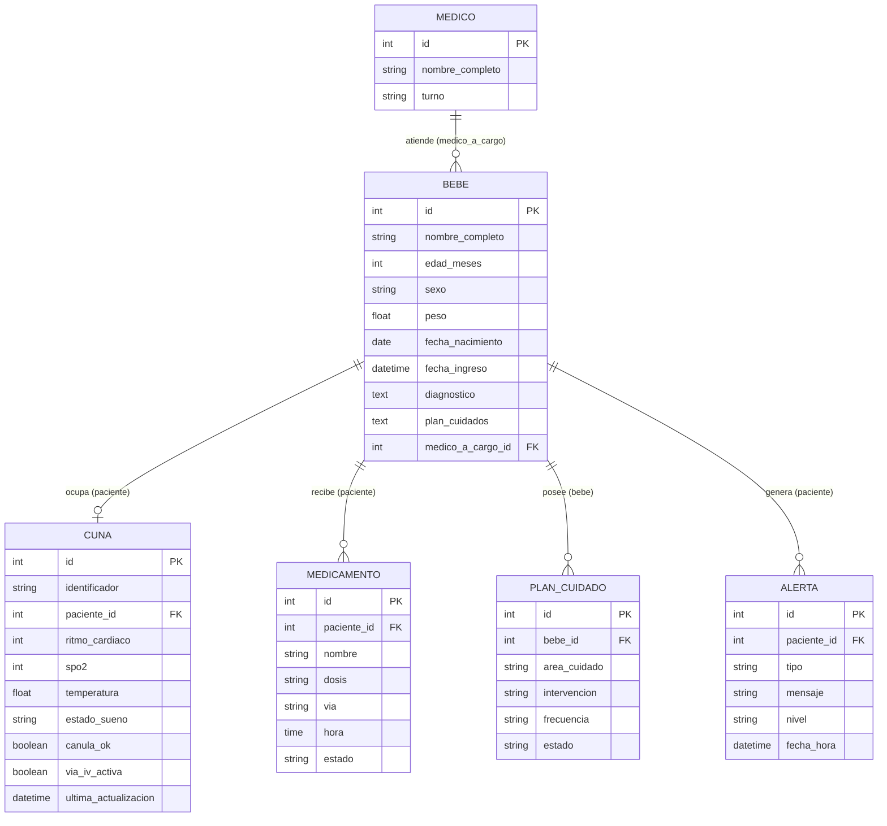

# Poki Koa — Sistema de Monitoreo Neonatal

> **Poki** (niño/hijo) · **Koa** (alegría, estar contento) — Lengua Rapa Nui

Sistema de monitoreo inteligente de cunas neonatales diseñado para supervisar en tiempo real las constantes vitales y parámetros ambientales de recién nacidos en unidades de cuidado. Centraliza alertas tempranas y datos clínicos para el personal médico.

El nombre **Poki Koa** busca entregar una identidad nacional al proyecto usando palabras de la lengua Rapa Nui, mientras que el **Moai** como elemento visual refuerza conceptos de protección, cuidado y vigilancia permanente.

> **Desarrollo**
> [Guía de Desarrollo e Instalación (DESARROLLO.md)](./DESARROLLO.md).

---

## Arquitectura

```
Backend (este repositorio)       Frontend (repositorio aparte)
┌─────────────────────────┐      ┌────────────────────────┐
│  Django REST Framework  │◄────►│  React + Vite          │
│  SQLite (desarrollo)    │      │  Puerto: 5173          │
│  Puerto: 8000           │      └────────────────────────┘
└─────────────────────────┘

API REST disponible en: http://127.0.0.1:8000/api/
  GET/POST  /api/medicos/
  GET/POST  /api/bebes/
  GET/POST  /api/cunas/
  (+ endpoints de detalle /{id}/ para cada uno)
```

---

## Requisitos

- [Git](https://git-scm.com/)
- Python 3.10 o superior
- [`uv`](https://docs.astral.sh/uv/getting-started/installation/) para gestionar el entorno virtual y las dependencias

> Si `uv` no está instalado, puedes obtenerlo con:
> ```bash
> # Linux o macOS
> curl -LsSf https://astral.sh/uv/install.sh | sh
> # Windows
> powershell -ExecutionPolicy ByPass -c "irm https://astral.sh/uv/install.ps1 | iex"
> ```

---

## Instalación y ejecución

### 1. Clonar el repositorio

```bash
git clone https://github.com/Asulx/poki-koa-backend.git
cd poki-koa-backend
```

### 2. Sincronizar las dependencias del proyecto

Esto crea el entorno virtual `.venv/` e instala todas las dependencias automáticamente:

```bash
uv sync
```

### 3. Aplicar las migraciones de base de datos

Solo es necesario la primera vez o cuando se agregan nuevos modelos:

```bash
uv run poki_koa migrate
```

### 4. Ejecutar el servidor de desarrollo

```bash
uv run poki_koa
```

Para acceder se usa la dirección: **http://127.0.0.1:8000/api** o **http://127.0.0.1:8000/admin**

---

## Otros comandos útiles

| Comando | Descripción |
|---|---|
| `uv run poki_koa` | Inicia el servidor de desarrollo en el puerto 8000 |
| `uv run poki_koa migrate` | Aplica migraciones pendientes a la base de datos |
| `uv run poki_koa test` | Ejecuta la suite de pruebas unitarias |
| `uv run poki_koa makemigrations` | Genera nuevas migraciones tras modificar modelos |
| `uv run poki_koa createsuperuser` | Crea un usuario administrador para el panel `/admin/` |
| `uv run make-crud <Modelo>` | Genera automáticamente Model, Serializer, ViewSet y URL para una entidad |
| `uv run ruff check` | Analiza el código, detecta errores y malas prácticas |

### Análisis del código con Ruff

[Ruff](https://docs.astral.sh/ruff/) es una herramienta de análisis estático para Python. Revisa el código sin ejecutarlo y detecta errores potenciales, imports no utilizados, problemas de estilo y otras malas prácticas.

### Automatización de nuevos recursos (make-crud)

Para acelerar la creación de nuevas entidades y evitar escribir repetitivamente en `serializers.py`, `views.py` y `urls.py`:

```bash
uv run make-crud <NombreModelo>
```

**Ejemplo:**
```bash
uv run make-crud Diagnostico
```

Este comando automatiza el flujo completo:
1. **`models.py`**: Crea una estructura base si el modelo no existe (si ya lo creaste tú, respeta tu código).
2. **`serializers.py`**: Importa el modelo y crea su `ModelSerializer`.
3. **`views.py`**: Importa el modelo y serializer, y crea su `ModelViewSet`.
4. **`urls.py`**: Registra la ruta de la API REST (ej: `/api/diagnosticos/`).

> **Nota:** Tras crear o editar tu modelo, recuerda generar y aplicar la migración:
> ```bash
> uv run poki_koa makemigrations
> uv run poki_koa migrate
> ```

---

## Estructura del proyecto

```
.
├── pyproject.toml          # Dependencias, versión del proyecto y comando `mamoru`
├── uv.lock                 # Versiones exactas de dependencias (no editar manualmente)
├── .python-version         # Versión de Python gestionada por uv
└── src/
    ├── manage.py           # CLI alternativa de Django (uso directo sin uv)
    ├── db.sqlite3          # Base de datos SQLite (desarrollo)
    ├── poki_koa/           # Configuración central del proyecto Django
    │   ├── settings.py     # Ajustes globales (BD, apps, CORS, etc.)
    │   ├── urls.py         # Rutas raíz: /admin/ y /api/
    │   ├── wsgi.py         # Punto de entrada para servidores WSGI (producción)
    │   └── main.py         # Función `main()` que activa el comando `mamoru`
    └── cunas/              # App principal del sistema
        ├── models.py       # Modelos: Medico, Bebe, Cuna
        ├── serializers.py  # Serializadores JSON para la API REST
        ├── views.py        # ViewSets: endpoints CRUD automáticos
        ├── urls.py         # Router con rutas /api/medicos/, /api/bebes/, /api/cunas/
        ├── admin.py        # Registro de modelos en el panel de administración
        ├── tests.py        # Pruebas unitarias de los modelos
        └── migrations/     # Migraciones de base de datos (generadas automáticamente)
```

---

## Historias de Usuario

Todas las historias están registradas como GitHub Issues.

| ID | Nombre | Issue |
|---|---|---|
| US-01 | Formulario de gestión de pacientes | [#1](https://github.com/Asulx/poki-koa-web/issues/15) |
| US-02 | Formulario de gestión de medicamentos | [#2](https://github.com/Asulx/poki-koa-web/issues/17) |
| US-03 | Listado de medicamentos | [#3](https://github.com/Asulx/poki-koa-web/issues/16) |
| US-04 | Listado de pacientes | [#4](https://github.com/Asulx/poki-koa-web/issues/13) |
| US-05 | Búsqueda de filtros y pacientes | [#5](https://github.com/Asulx/poki-koa-web/issues/14) |
| US-06 | Gráficos interactivos y visualización de estadísticas | [#6](https://github.com/Asulx/poki-koa-web/issues/12) |
| US-07 | Vista y lógica del módulo de reportes | [#7](https://github.com/Asulx/poki-koa-web/issues/18) |
| US-08 | Exportación de reportes (PDF y Excel) | [#8](https://github.com/Asulx/poki-koa-web/issues/19) |
| US-09 | Gestión y modificación de turnos por ADMIN | [#9](https://github.com/Asulx/poki-koa-web/issues/39) |
| US-10 | Navegación interactiva de Monitor de cuna hacia detalles de bebé | [#10](https://github.com/Asulx/poki-koa-web/issues/40) |

## Requisitos Extrafuncionales

Ver: [ReqExtrafuncionales.md](./ReqExtrafuncionales.md)

## Entidades del Dominio



## Roles de Equipo

| Integrante | Rol | Ítems de la rúbrica a cargo |
| :--- | :--- | :--- |
| **Sebastian Quinzacaras** | Analista / Arquitecto | • 1.1 Historias de Usuario: Completitud<br>• 1.1 Historias de Usuario: Correctitud (forma)<br>• 1.1 Historias de Usuario: Calidad |
| **Ricardo Figueroa** | Diseñador de Software | • 2.3 Diseño Arquitectónico: Módulos - Completitud<br>• 2.1 Diseño Arquitectónico: Módulos - Calidad |
| **Mauricio Escobar** | Líder Técnico | • 2.2 Diagrama de Arquitectura: Consistencia<br>• 2.4 Entidades del dominio: Completitud |
| **Ricardo Loyola** | Arquitecto de Software | • 1.2 Requisitos Extrafuncionales: Catálogo extrafuncionales<br>• 2.1 Diseño Arquitectónico: Estilo arquitectónico |
| **Fabian Mamani** | QA Tester / Diseñador UI | • 2.3 Mockups: Consistencia |
| **Sarai Herrera** | Analista / Arquitecto | • 1.1 Historias de Usuario: Completitud<br>• 1.1 Historias de Usuario: Correctitud (forma)<br>• 1.1 Historias de Usuario: Calidad |
