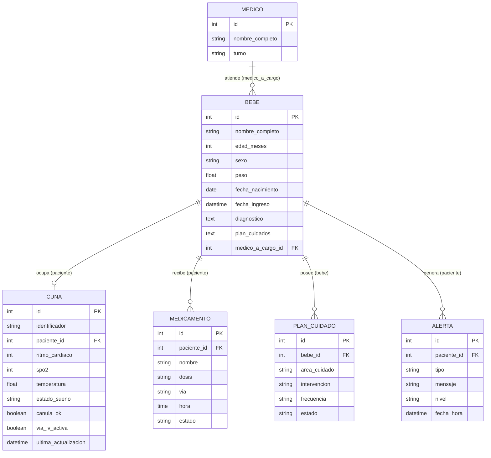

# Poki Koa — Sistema de Monitoreo Neonatal (Backend)

> **Poki** (niño/hijo) · **Koa** (alegría, estar contento) — Lengua Rapa Nui

Sistema de monitoreo inteligente de cunas neonatales diseñado para supervisar en tiempo real las constantes vitales y parámetros ambientales de recién nacidos en unidades de cuidado. Centraliza alertas tempranas y datos clínicos para el personal médico.

El nombre **Poki Koa** entrega identidad nacional al proyecto mediante palabras de la lengua Rapa Nui, complementado con la figura del **Moai** como elemento visual que refuerza los conceptos de protección, cuidado y vigilancia permanente.

---

## Documentación del Proyecto

- [Arquitectura del Sistema](./Arquitectura.md) (Estilo arquitectónico, componentes y justificación)
- [Requisitos Extrafuncionales](./ReqExtrafuncionales.md) (Catálogo de atributos de calidad y restricciones)

---

## Arquitectura

El sistema implementa una arquitectura desacoplada cliente-servidor:

```text
Backend (este repositorio)       Frontend (repositorio aparte)
┌─────────────────────────┐      ┌────────────────────────┐
│  Django REST Framework  │◄────►│  React + Vite          │
│  SQLite (desarrollo)    │      │  Puerto: 5173          │
│  Puerto: 8000           │      └────────────────────────┘
└─────────────────────────┘
```

- **API REST**: `http://127.0.0.1:8000/api/` (endpoints para `/api/medicos/`, `/api/bebes/`, `/api/cunas/`, etc.)
- **Panel Administrativo**: `http://127.0.0.1:8000/admin/`

---

## Guía de Instalación y Puesta en Marcha

Sigue estos pasos para clonar, configurar y ejecutar el backend localmente en pocos minutos.

### Requisitos Previos

- [Git](https://git-scm.com/)
- [Python](https://www.python.org/) 3.10 o superior
- [`uv`](https://docs.astral.sh/uv/) (gestor de entornos y dependencias de alto rendimiento)

> **Instalación rápida de `uv` (si aún no lo tienes):**
> - **Linux o macOS:**
>   ```bash
>   curl -LsSf https://astral.sh/uv/install.sh | sh
>   ```
> - **Windows (PowerShell):**
>   ```powershell
>   powershell -ExecutionPolicy ByPass -c "irm https://astral.sh/uv/install.ps1 | iex"
>   ```

---

### Paso a Paso

#### 1. Clonar el repositorio
```bash
git clone https://github.com/Asulx/poki-koa-backend.git
cd poki-koa-backend
```

#### 2. Sincronizar dependencias
Crea automáticamente el entorno virtual en `.venv/` e instala todas las dependencias requeridas:
```bash
uv sync
```

#### 3. Aplicar migraciones
Inicializa o actualiza la base de datos SQLite con los modelos del sistema:
```bash
uv run poki_koa migrate
```

#### 4. Iniciar el servidor de desarrollo
```bash
uv run poki_koa
```

El backend quedará accesible en:
- **API REST**: [http://127.0.0.1:8000/api/](http://127.0.0.1:8000/api/)
- **Panel de Administración**: [http://127.0.0.1:8000/admin/](http://127.0.0.1:8000/admin/)

> *Nota alternativa:* También es posible utilizar directamente la CLI estándar de Django mediante `python src/manage.py [comando]`.

---

## Comandos Útiles

| Comando | Descripción |
|---|---|
| `uv run poki_koa` | Inicia el servidor de desarrollo en el puerto 8000 |
| `uv run poki_koa migrate` | Aplica migraciones pendientes a la base de datos |
| `uv run poki_koa makemigrations` | Genera nuevas migraciones tras modificar modelos |
| `uv run poki_koa test` | Ejecuta la suite de pruebas unitarias |
| `uv run poki_koa createsuperuser` | Crea un usuario administrador para el panel `/admin/` |
| `uv run make-crud <Modelo>` | Genera automáticamente Model, Serializer, ViewSet y URL para una entidad |
| `uv run ruff check` | Analiza el código con [Ruff](https://docs.astral.sh/ruff/) para detectar errores y estilo |

### Automatización de Recursos (`make-crud`)

Para acelerar la creación de nuevas entidades y evitar configuraciones repetitivas:
```bash
uv run make-crud <NombreModelo>
```

**Ejemplo:**
```bash
uv run make-crud Diagnostico
```

Este comando genera y conecta de forma automática:
1. **`models.py`**: Estructura base del modelo (respeta tu código si ya existía).
2. **`serializers.py`**: `ModelSerializer` correspondiente.
3. **`views.py`**: `ModelViewSet` con operaciones CRUD completas.
4. **`urls.py`**: Registro automático en el router REST (ej: `/api/diagnosticos/`).

> **Importante:** Tras crear o editar cualquier modelo, recuerda generar y aplicar la migración:
> ```bash
> uv run poki_koa makemigrations
> uv run poki_koa migrate
> ```

---

## Estructura del Proyecto

```text
.
├── pyproject.toml          # Dependencias y comandos de ejecución (uv + hatchling)
├── uv.lock                 # Registro exacto de versiones de dependencias
├── .python-version         # Versión de Python fijada para el proyecto
├── Arquitectura.md         # Documento detallado de diseño arquitectónico
├── ReqExtrafuncionales.md  # Catálogo de requisitos extrafuncionales
└── src/
    ├── manage.py           # CLI estándar de Django (uso alternativo sin uv)
    ├── db.sqlite3          # Base de datos SQLite para desarrollo
    ├── poki_koa/           # Configuración central del proyecto Django
    │   ├── settings.py     # Ajustes globales (base de datos, apps, CORS)
    │   ├── urls.py         # Rutas principales: /admin/ y /api/
    │   ├── wsgi.py         # Entrada para servidores WSGI
    │   └── main.py         # Script principal que ejecuta el comando `poki_koa`
    └── cunas/              # Aplicación principal del dominio neonatal
        ├── models.py       # Modelos clínicos (Medico, Bebe, Cuna, Medicamento, etc.)
        ├── serializers.py  # Serializadores JSON para la API REST
        ├── views.py        # ViewSets con endpoints CRUD
        ├── urls.py         # Enrutamiento de la app (/api/medicos/, /api/bebes/, /api/cunas/)
        ├── admin.py        # Registro en el panel administrativo
        ├── tests.py        # Pruebas unitarias
        ├── management/     # Comandos personalizados (make-crud)
        └── migrations/     # Historial de migraciones generadas
```

---

## Entidades del Dominio



---

## Historias de Usuario

Todas las historias de usuario están registradas como GitHub Issues:

| ID | Nombre | Issue |
|---|---|---|
| US-01 | Formulario de gestion de pacientes | [#1](https://github.com/Asulx/poki-koa-web/issues/15) |
| US-02 | Formulario de gestion de medicamentos | [#2](https://github.com/Asulx/poki-koa-web/issues/17) |
| US-03 | Listado de medicamentos | [#3](https://github.com/Asulx/poki-koa-web/issues/16) |
| US-04 | Listado de pacientes | [#4](https://github.com/Asulx/poki-koa-web/issues/13) |
| US-05 | Busqueda de filtros y pacientes | [#5](https://github.com/Asulx/poki-koa-web/issues/14) |
| US-06 | Graficos interactivos y visualizacion de estadisticas | [#6](https://github.com/Asulx/poki-koa-web/issues/12) |
| US-07 | Vista y logica del modulo de reportes | [#7](https://github.com/Asulx/poki-koa-web/issues/18) |
| US-08 | Exportacion de reportes (PDF y Excel) | [#8](https://github.com/Asulx/poki-koa-web/issues/19) |
| US-09 | Gestion y modificacion de turnos por ADMIN | [#9](https://github.com/Asulx/poki-koa-web/issues/39) |
| US-10 | Navegacion interactiva de Monitor de cuna hacia detalles de bebe | [#10](https://github.com/Asulx/poki-koa-web/issues/40) |

---

## Roles de Equipo

| Integrante | Rol | Ítems de la rúbrica a cargo |
| :--- | :--- | :--- |
| **Sebastian Quinzacaras** | Analista / Arquitecto | • 1.1 Historias de Usuario: Completitud<br>• 1.1 Historias de Usuario: Correctitud (forma)<br>• 1.1 Historias de Usuario: Calidad |
| **Ricardo Figueroa** | Diseñador de Software | • 2.3 Diseño Arquitectónico: Módulos - Completitud<br>• 2.1 Diseño Arquitectónico: Módulos - Calidad |
| **Mauricio Escobar** | Líder Técnico | • 2.2 Diagrama de Arquitectura: Consistencia<br>• 2.4 Entidades del dominio: Completitud |
| **Ricardo Loyola** | Arquitecto de Software | • 1.2 Requisitos Extrafuncionales: Catálogo extrafuncionales<br>• 2.1 Diseño Arquitectónico: Estilo arquitectónico |
| **Fabian Mamani** | QA Tester / Diseñador UI | • 2.3 Mockups: Consistencia |
| **Sarai Herrera** | Analista / Arquitecto | • 1.1 Historias de Usuario: Completitud<br>• 1.1 Historias de Usuario: Correctitud (forma)<br>• 1.1 Historias de Usuario: Calidad |
