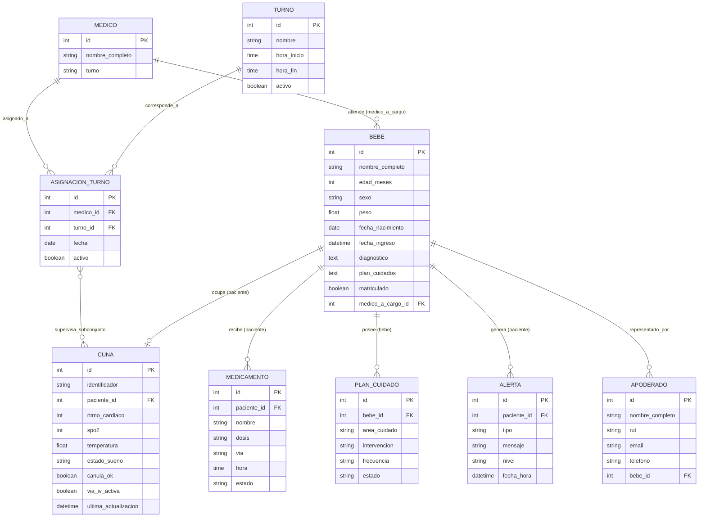

# Poki Koa — Sistema de Monitoreo Neonatal

> **Poki** (niño/hijo) · **Koa** (alegría, estar contento) — Lengua Rapa Nui

Sistema de monitoreo inteligente de cunas neonatales diseñado para supervisar en tiempo real las constantes vitales y parámetros ambientales de recién nacidos en unidades de cuidado. Centraliza alertas tempranas y datos clínicos para el personal médico.

> **Desarrollo**  
> [Guía de Desarrollo e Instalación (DESARROLLO.md)](./DESARROLLO.md).

---

## Historias de Usuario
Todas las historias están registradas como GitHub Issues.

| ID | Nombre | Issue |
|---|---|---|
| US-01 | Formulario de gestion de pacientes | [#1](https://github.com/Asulx/poki-koa-web/issues/15) |
| US-02 | Formulario de gestion de medicamentos | [#2](https://github.com/Asulx/poki-koa-web/issues/17) |
| US-03 | Listado de medicamentos | [#3](https://github.com/Asulx/poki-koa-web/issues/16) |
| US-04 | Listado de pacientes | [#4](https://github.com/Asulx/poki-koa-web/issues/13) |
| US-05 | Busqueda de filtros y pacientes | [#5](https://github.com/Asulx/poki-koa-web/issues/14) |
| US-06 | Graficos interactivos y visualizacion de estadisticas | [#6](https://github.com/Asulx/poki-koa-web/issues/12) |
| US-07 | Vista y logica del modulo de reportes | [#7](https://github.com/Asulx/poki-koa-web/issues/18) |
| US-08 | Exportacion de reportes (PDF y Excel) | [#8](https://github.com/Asulx/poki-koa-web/issues/19) |
| US-09 | Gestion y modificacion de turnos por ADMIN | [#9](https://github.com/Asulx/poki-koa-web/issues/39) |
| US-10 | Navegacion interactiva de Monitor de cuna hacia detalles de bebe | [#10](https://github.com/Asulx/poki-koa-web/issues/40) |
| CR-402 | Del hogar a la sala cuna institucional con cuarenta cunas y turnos | [#42](https://github.com/Asulx/poki-koa-backend/issues/42) |


## Requisitos Extrafuncionales
Ver: [ReqExtrafuncionales.md](./ReqExtrafuncionales.md)

## Entidades del Dominio



## Escala Institucional (CR-402)

Para soportar la transición desde el hogar a una sala institucional / unidad neonatal:
- **40 Cunas de monitoreo:** Identificadores `C01` a `C40` con telemetría independiente.
- **12 Profesionales en turnos rotativos:** Médicos y matronas organizados en turnos (Mañana, Tarde, Noche), con asignación de un subconjunto de cunas que cambia según el turno.
- **Matriz de visibilidad según rol:**
  - **Directora:** Acceso y supervisión global de las 40 cunas.
  - **Profesionales:** Visualizan únicamente el subconjunto de cunas asignado a su turno rotativo.
  - **Apoderados:** Acceso exclusivo a la cuna de su propio hijo, y **únicamente mientras mantenga matrícula activa** en la institución.

Para poblar automáticamente este escenario para pruebas:
```bash
uv run poki_koa poblar_escala --limpiar
```

## Observaciones issue CR-402
Al revisar las modificaciones y requerimientos, nos encontramos con un cambio drastico de la idea principal del programa, cambiando el foco de Cunas de Instituciones hospitalarias a cunas de instituciones educacionales.

Ahora tenemos que tener en consideracion el manejo de datos no solo de funcionarios medicos, sino que tambien tenemos que manejar los datos para que sean accesibles para ciudadanos comunes.

## Roles de Equipo
| Integrante | Rol | Ítems de la rúbrica a cargo |
| :--- | :--- | :--- |
| **Sebastian Quinzacaras** | Analista / Arquitecto | • 1.1 Historias de Usuario: Completitud<br>• 1.1 Historias de Usuario: Correctitud (forma)<br>• 1.1 Historias de Usuario: Calidad |
| **Ricardo Figueroa** | Diseñador de Software | • 2.3 Diseño Arquitectónico: Módulos - Completitud<br>• 2.1 Diseño Arquitectónico: Módulos - Calidad |
| **Mauricio Escobar** | Líder Técnico | • 2.2 Diagrama de Arquitectura: Consistencia<br>• 2.4 Entidades del dominio: Completitud |
| **Ricardo Loyola** | Arquitecto de Software | • 1.2 Requisitos Extrafuncionales: Catálogo extrafuncionales<br>• 2.1 Diseño Arquitectónico: Estilo arquitectónico |
| **Fabian Mamani** | QA Tester / Diseñador UI | • 2.3 Mockups: Consistencia |
| **Sarai Herrera** | Analista / Arquitecto | • 1.1 Historias de Usuario: Completitud<br>• 1.1 Historias de Usuario: Correctitud (forma)<br>• 1.1 Historias de Usuario: Calidad |
